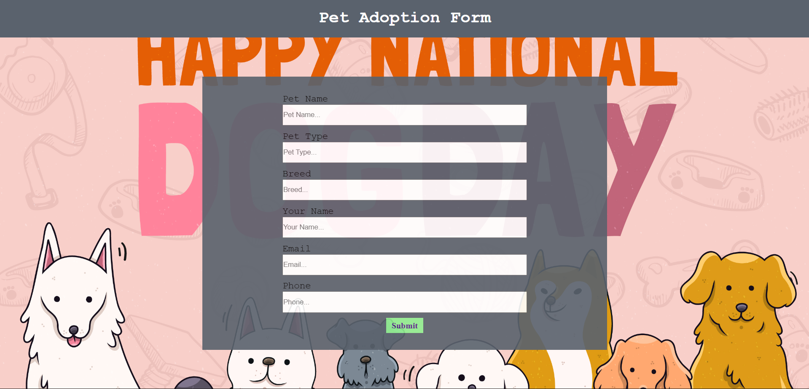
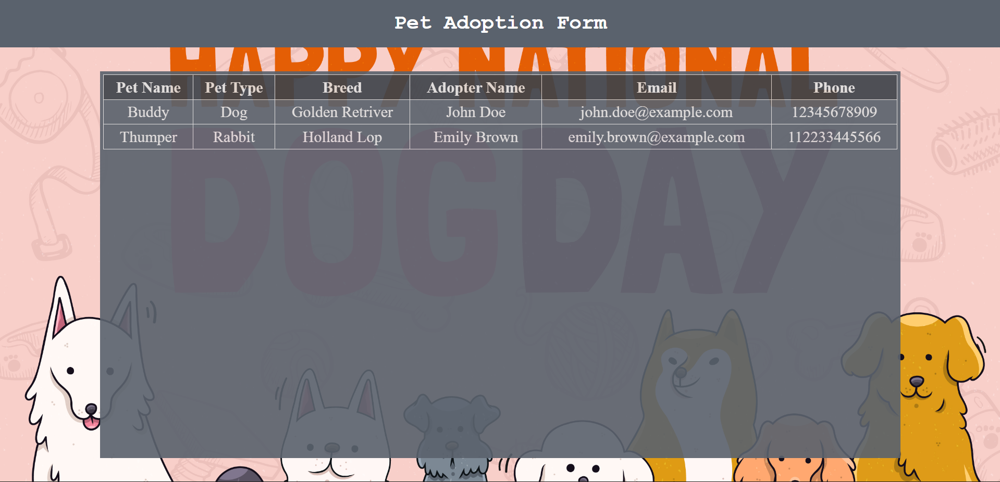

# 🐾 Pet Adoption App

A simple React-based **Pet Adoption Management App** that allows users to:

* Fill in a pet adoption form 📝
* View all adoption requests in a dynamic table 📋
* Manage adopter details in real-time using React Context ⚡

This project demonstrates **React Router, Context API, and component-based UI design** in a beginner-friendly way.

---

## ✨ Features

✅ Adoption form to capture details (Pet name, type, breed, adopter info)
✅ Adoption table displaying submitted records dynamically
✅ React Context API for state management
✅ Routing with `react-router-dom`
✅ Styled with CSS for a clean UI
✅ Fully responsive

---

## 📸 Screenshots

### 📝 Adoption Form



### 📋 Adoption Table



---

## 🛠️ Tech Stack

* **React.js** (Frontend library)
* **React Router DOM** (Routing)
* **Context API** (State Management)
* **CSS** (Styling)

---

## 🚀 Getting Started

### 1️⃣ Clone the Repository

```bash
git clone https://github.com/your-username/petAdoption.git
cd petAdoption
```

### 2️⃣ Install Dependencies

```bash
npm install
```

### 3️⃣ Run the App

```bash
npm run dev
```

Then open 👉 [http://localhost:5173](http://localhost:5173) in your browser.

---

## 📂 Project Structure

```
petAdoption/
│── public/
│── src/
│   ├── components/
│   │   ├── AdoptionForm.jsx
│   │   ├── AdoptionTable.jsx
│   │   ├── Header.jsx
│   │   ├── Layout.jsx
│   │   ├── DetailsContextProvider.jsx
│   ├── Css/
│   │   ├── AdoptionForm.css
│   │   ├── AdoptionTable.css
│   │   ├── Header.css
│   ├── App.jsx
│   ├── App.css
│── package.json
│── README.md
```

---

## 🤝 Contribution

Contributions are welcome!

* Fork the repo 🍴
* Create a new branch 🌱
* Make your changes 💡
* Submit a PR 🚀
