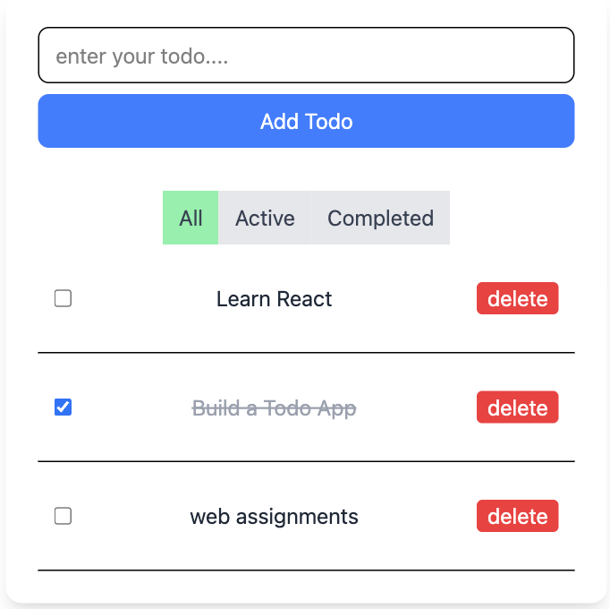
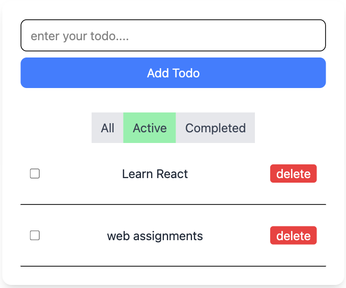
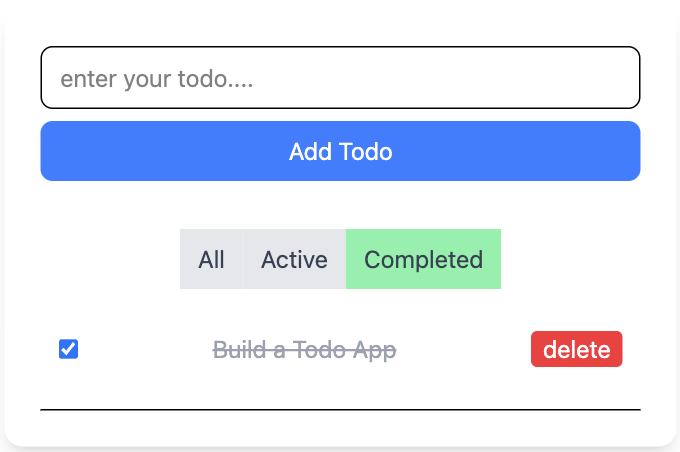

# 📝 Proj-01-Todo (React + Tailwind CSS)

A simple yet powerful **Todo App** built with **React** and styled with **Tailwind CSS**.  
This project demonstrates **CRUD operations**, **filtering**, and **state management** using React hooks.

---

## ✨ Features
- ➕ **Add new todos**  
- ✅ **Mark todos as completed**  
- ❌ **Delete todos**  
- 🔎 **Filter todos** by:
  - 📋 All
  - 🟢 Active
  - ✅ Completed
- ⚡ **Real-time UI updates** using React state  
- 🎨 **Clean and responsive UI** with TailwindCSS  

---

## 📸 Screenshots

### 📋 All Todos


### 🟢 Active Todos


### ✅ Completed Todos



---

## 🛠️ Tech Stack
- ⚛️ **React** – for building the UI  
- 🎨 **Tailwind CSS** – for styling  
- 📜 **JavaScript (ES6+)** – core logic  
- ⚡ **Vite / CRA** – development setup  

---

## 📂 Project Structure
```bash
Proj-01-Todo/
├── 📄 README.md
├── 📦 package.json
├── ⚡ vite.config.js (or CRA config)
└── 📂 src
    ├── 📂 assets
    │   ├── All.png
    │   ├── Active.png
    │   └── Completed.png
    ├── 📂 components
    │   ├── TodoItem.jsx
    │   └── TodoList.jsx
    ├── App.jsx
    ├── index.css
    └── main.jsx
````

---

## 🚀 Getting Started

Follow these steps to run the project locally:

### 1️⃣ Clone the repository

```bash
git clone https://github.com/kurk6455/Proj-01-Todo.git
cd Proj-01-Todo
```

### 2️⃣ Install dependencies

```bash
npm install
```

### 3️⃣ Run the development server

```bash
npm run dev
```

Now, open 👉 [http://localhost:5173](http://localhost:5173) in your browser.

---

## 🤝 Contributing

Contributions, issues, and feature requests are welcome!
Feel free to fork the repo and submit a PR. 🎉

---

## 📜 License

This project is licensed under the **MIT License**.

---

💡 *Built with ❤️ using React + Tailwind CSS*
