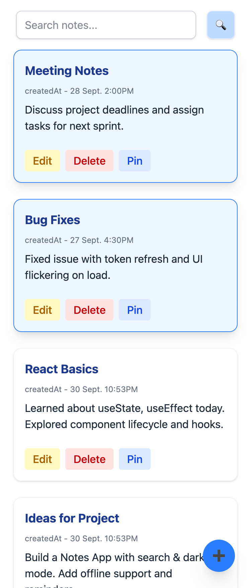
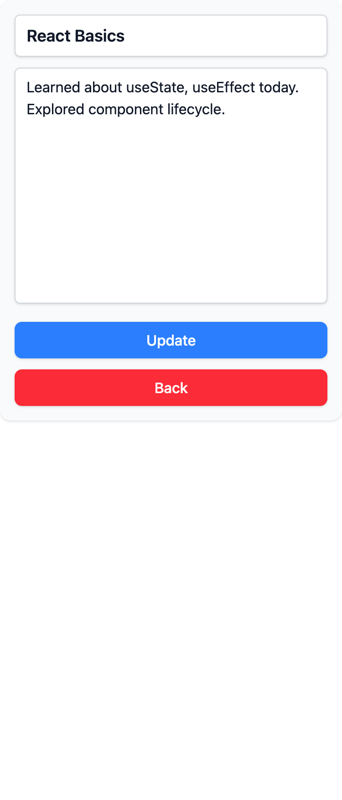
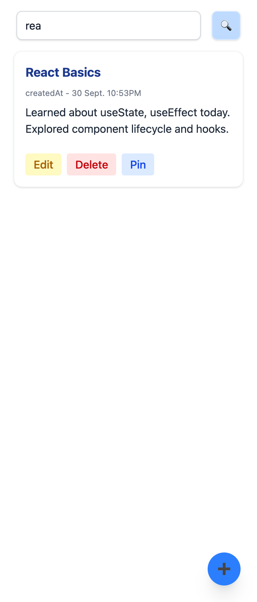

---

# 📝 Notes App (Basic)

A minimal React notes app to create, edit, search, and pin notes.
Built as a foundation for a full-featured notes system.

---

## 🚀 Features

* ➕ Add new notes
* ✏️ Edit existing notes
* ❌ Delete notes
* 📌 Pin/Unpin notes (pinned notes always stay on top)
* 🔍 Search notes by title/content
* 💾 LocalStorage persistence (notes stay saved after refresh)
* ⏱ Auto timestamp on create/update

---

## 📱 Screenshots

<p align="center">
  
  
  
</p>

---

## ⚙️ Tech Stack

* React (Hooks: `useState`, `useEffect`)
* JavaScript ES6+
* CSS / Tailwind-ready

---

## 🛠 Setup

```bash
git clone https://github.com/kurk6455/react-assignment.git
cd proj-02-notes-app-basic
npm install
npm start
```

---