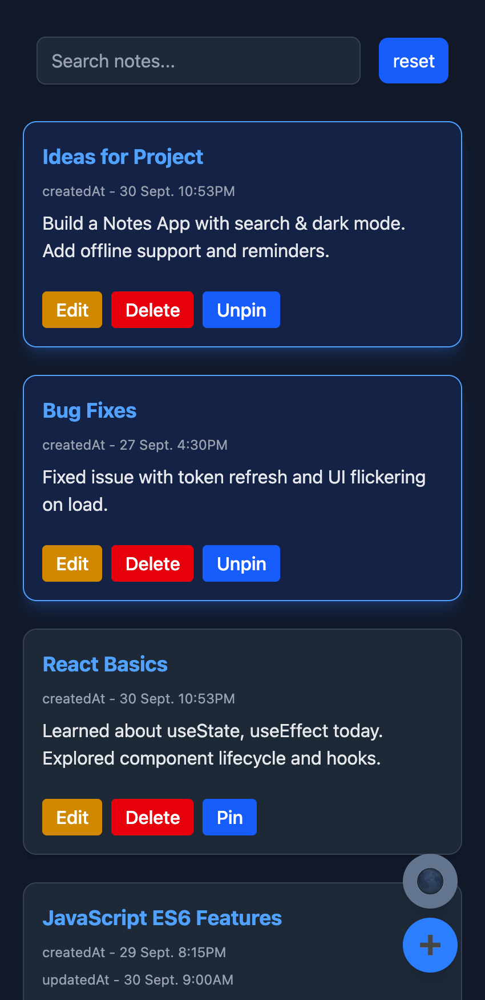
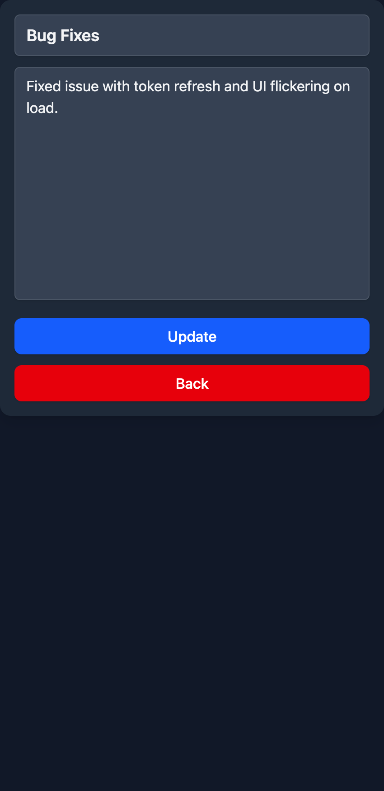
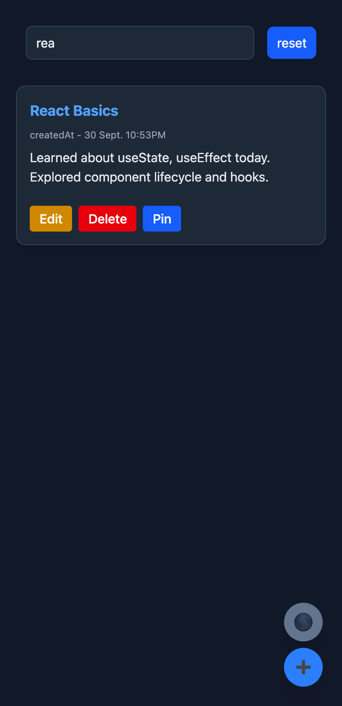
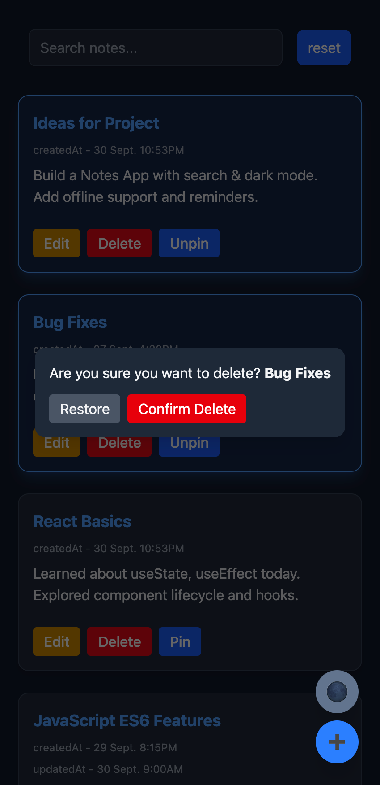

---

# 📝 Notes App (Advance)

A **React-based Notes App** with all essential note-taking features — search, pinning, dark mode, and persistent storage — wrapped in a clean and minimal UI.

---

## 🚀 Features

### 🗂 Note Management

* ➕ Create new notes
* ✏️ Edit and update existing notes
* ❌ Delete notes with confirmation

### 📌 Organization

* Pin/Unpin notes — pinned notes always stay on top
* Notes automatically sorted by last updated / created time

### 🔍 Smart Search

* Real-time search by **title** or **content**
* Reset search with one click

### 🌗 Dark Mode

* Toggle between **light** and **dark** mode
* Smooth theme transition

### 💾 Persistence

* Notes saved in **LocalStorage**
* Automatically loaded on refresh

### ⏱ Timestamps

* Auto-generated **createdAt** & **updatedAt** for each note

---

## 📱 Screenshots

<p align="center">
  
  
  
  
</p>

---

## ⚙️ Tech Stack

* React (Context API + Hooks)
* JavaScript (ES6+)
* Tailwind CSS (Dark mode ready)

---

## 🛠 Setup

```bash
git clone https://github.com/kurk6455/react-assignment.git
cd proj-02-notes-app-basic
npm install
npm start
```

---

## 💡 Future Enhancements

* 🏷 Tagging & categories
* 🔔 Reminders & notifications
* ☁️ Cloud sync support

---