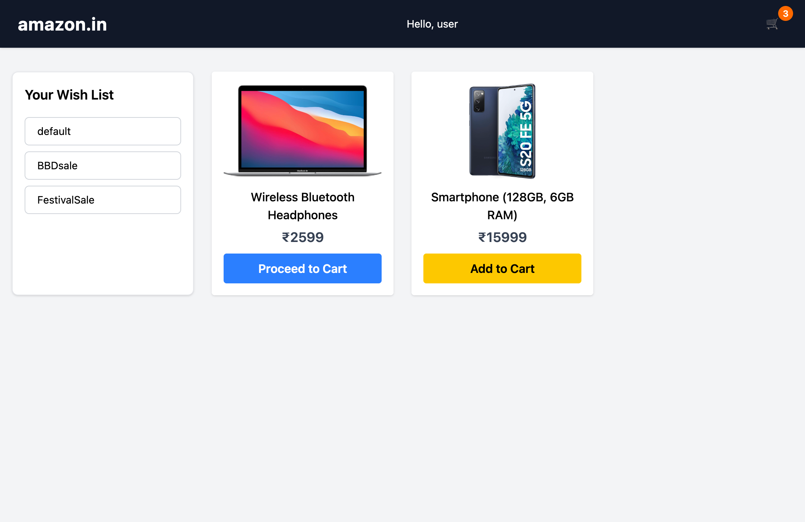
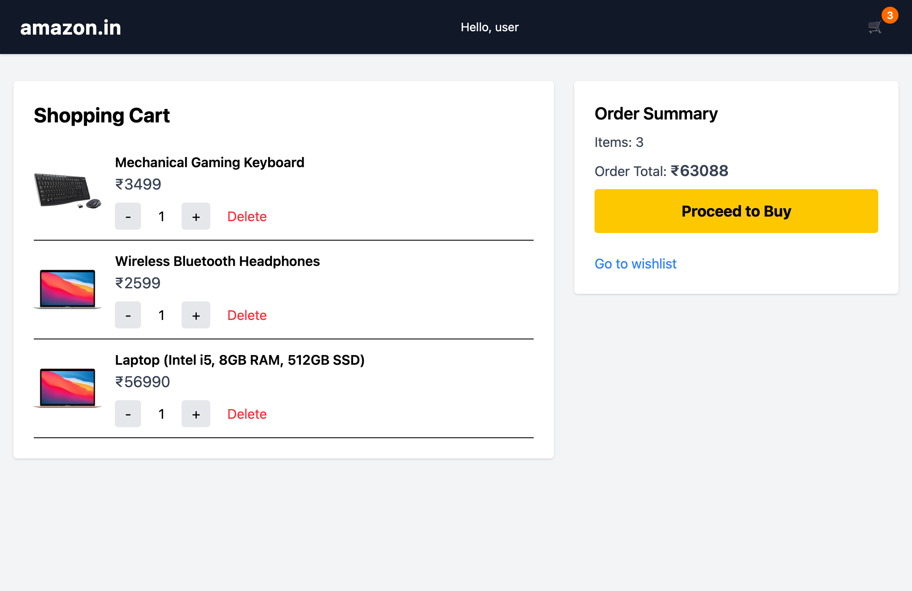
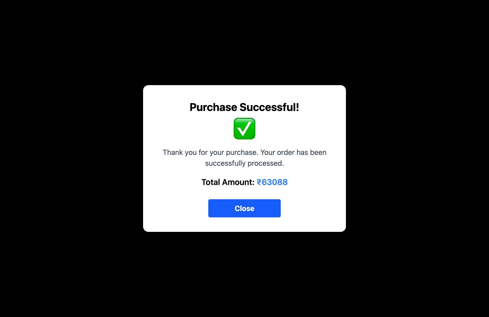

---

# 🛒 Shopping Cart & Wishlist App (Basic)

A **React-based e-commerce app** that simulates a mini Amazon-like experience — featuring **wishlist management**, **cart operations**, and a **purchase success flow**, all powered by the **Context API** with persistent state.

---

## 🚀 Features

### 🎁 Wishlist

* Preloaded with sample products — laptop, smartwatch, keyboard, etc.
* Filter wishlist by **type** (`default`, `BBD Sale`, `Festival Sale`)
* Add any item directly to **cart**
* Auto-synced with **LocalStorage** for data persistence

### 🛒 Shopping Cart

* Real-time cart updates synced from wishlist
* **Increase / decrease quantity** of each product
* **Delete item** (restores it back to wishlist)
* Empty cart shows a clean empty state

### 💵 Order Summary & Checkout

* Auto-calculated **total items** and **total price**
* “Proceed to Buy” triggers **purchase success modal**
* On confirmation, clears cart and resets wishlist

### 🧭 Navigation & Layout

* `/` → Wishlist view
* `/cart` → Shopping cart + order summary
* **Header** shows live cart count, brand name, and user greeting

### 💾 Persistent Storage

* All wishlist and cart states saved in **LocalStorage**
* Auto-loaded on browser refresh

---

## 🧱 Architecture Overview

```
src/
 ┣ components/
 ┃ ┣ CartItem.jsx
 ┃ ┣ Header.jsx
 ┃ ┣ PurchaseSuccessful.jsx
 ┃ ┣ ShoppingCart.jsx
 ┃ ┣ WishItem.jsx
 ┃ ┗ WishList.jsx
 ┣ utilities/
 ┃ ┣ OrderTotalProvider.jsx
 ┃ ┣ ShoppingCartProvider.jsx
 ┃ ┣ WishListDataProvider.jsx
 ┃ ┗ WishListUIProvider.jsx
 ┣ assets/
 ┃ ┣ wishlist.png
 ┃ ┣ shoppingcart.png
 ┃ ┗ purchaseSuccessful.png
 ┣ App.jsx
 ┣ main.jsx
 ┣ index.css
 ┗ App.css
```

---

## 📱 Screenshots

<p align="center">
  
  
  
</p>

---

## ⚙️ Tech Stack

* **React 18** (Hooks + Context API)
* **React Router DOM** for routing
* **Tailwind CSS** for styling
* **LocalStorage** for persistence

---

## 🛠 Setup

```bash
git clone https://github.com/kurk6455/proj-04-shopping-cart-basic.git
cd proj-04-shopping-cart-basic
npm install
npm run dev
```

---

## 💡 Future Enhancements

* 🏷 Apply discount codes
* ☁️ Cloud sync (Firebase / Supabase)
* 🔔 Toast notifications
* 💳 Payment gateway integration

---