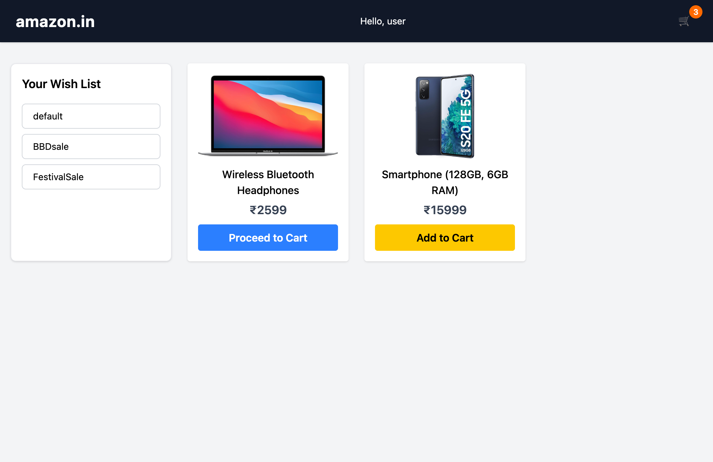
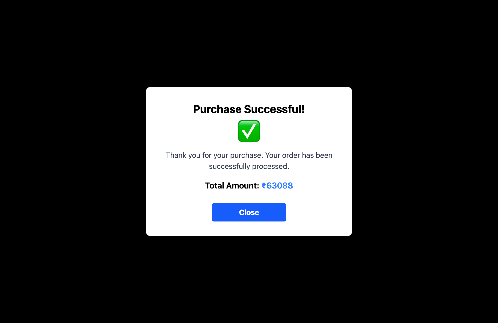

# 🛍️ Shopping Cart & Wishlist App (Recoil Edition)

A modern e-commerce shopping cart built with React, Recoil for state management, and Tailwind CSS.

## 📸 Screenshots

| Wishlist | Shopping Cart | Purchase Success |
|----------|---------------|------------------|
|  |  |  |

## ✨ Features

### 🎯 Smart Wishlist Management
- **Dynamic Category Filtering**: Organize products across multiple wishlists (Default, BBD Sale, Festival Sale)
- **Instant Category Switching**: Seamlessly browse different product collections with a single click
- **Visual Product Cards**: Rich product display with images, titles, and pricing

### 🛒 Powerful Shopping Cart
- **One-Click Add to Cart**: Instantly move items from wishlist to cart
- **Smart Quantity Controls**: Increment/decrement product quantities with intuitive +/- buttons
- **Quick Remove**: Delete items from cart or automatically remove when quantity reaches zero
- **Live Cart Badge**: Header displays real-time item count for instant cart status

### 💰 Intelligent Order Management
- **Real-Time Calculations**: Automatic computation of total items and order value
- **Order Summary Panel**: Clear breakdown of cart contents and total price
- **Purchase Confirmation**: Beautiful success modal with order details
- **Auto-Reset Cart**: Smooth cart clearing after successful purchase

### 🎨 Modern User Experience
- **Responsive Design**: Flawless experience across desktop, tablet, and mobile devices
- **Smooth Transitions**: Polished hover effects and UI interactions
- **Clean Interface**: Amazon-inspired design with intuitive navigation
- **Optimized Performance**: Recoil-powered state management ensures lightning-fast updates

## 🛠️ Tech Stack

- React 18 + Recoil
- React Router DOM
- Tailwind CSS
- Vite

## 📁 Project Structure

```
src/
├── assets/              # Screenshots
├── components/          # React components
│   ├── CartItem.jsx
│   ├── Header.jsx
│   ├── PurchaseSuccessful.jsx
│   ├── ShoppingCart.jsx
│   ├── WishItem.jsx
│   └── WishList.jsx
├── utilities/
│   └── recoil_state.js  # State management
├── App.jsx
└── main.jsx
```

## 🚀 Quick Start

```bash
# Install dependencies
npm install

# Start development server
npm run dev

# Build for production
npm run build
```

## 🔍 State Management

**Recoil Atoms:**
- `wishListIdState` - Product IDs
- `wishListState` - Individual product data (atomFamily)
- `selectedTypeState` - Active category filter
- `purchaseState` - Purchase modal visibility

**Recoil Selectors:**
- `wishListBtnState` - Available categories
- `filteredWishListState` - Filtered products
- `shoppingCartState` - Cart items
- `orderTotalState` - Total quantity & price

## 💡 How It Works

1. Browse products in categorized wishlists
2. Add items to cart
3. Adjust quantities or remove items
4. Complete purchase with confirmation
5. Cart resets automatically after purchase


---

Built with React & Recoil